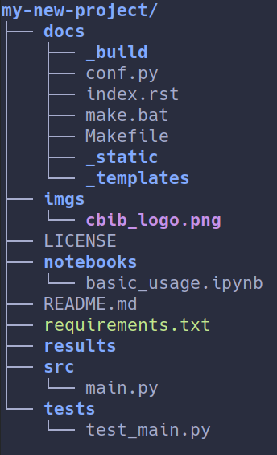

# Python CookieCutter

CBiB's template for python projects.


## Installation
```sh
pip install cookiecutter
```

Or with conda: 
```sh
conda install -c conda-forge cookiecutter
```
>*Note:* If you are using conda, I advise you to install cookiecutter in your base environment.
##  Usage
First, create a new github repo, do not check `Initialize this repository with a README`.

Then we will call cookiecutter in order to download the template:
```sh
cookiecutter https://github.com/EdgarLefevre/cbib_python_template.git
```

Next, the software will ask you some questions:
- *project_name* : the name of the project
- *src_dir* : name of the source directory
- *results_dir* : name of the results directory
- *github_username* : your github username
- *author* : the name of the author
- *year* : the year of the project
- *tests* : if you want to generate tests folder
- *docs* : if you want to generate documentation folder
- *notebooks* : if you want to generate notebooks folder
- *github_actions* : if you want to generate github actions
- *example* : if you want to generate an example for documentation and tests
- *project_slug* : the slug of the project (type enter, in the next versions you will not see this prompt)
- *test_file* : the name of the test file (same as for the project_slug)


Once everything is downloaded, run git commands:
```sh
cd <project_name>
git init
git remote add origin git@github.com:YOURNAME/YOURREPO.git
git add *
git commit -am "First commit"
git push -u origin master
```
## Architecture



The template provides a classic python project architecture:
- src: here are your sources
- result_dir: Outputs files
- docs: folder where the documentation will be generated
- test: folder for test files
- notebooks: folder for example notebooks

With all those folders, come some config files:
 - .gitignore: config file for git, it excludes files from the git repo
 - README.md
 - LICENSE

